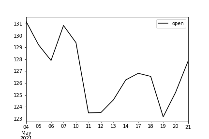

<code>technitrade</code> *is a developing public python library of all (or rather most) financial technical indicators*

estimated completion of v.0.1 --> Q4 2021

---
#### Table of Contents
* [Requirements](#requirements)
* [Usage](#usage)
* [Market Data](#market-data)
* [Technical Analysis](#technical-analysis)
    * [RSI](#rsi)
    * [Williams Range](#williams-range)
    * [Aroon Indicator](#aroon-indicator)

---

## Requirements
<code>technitrade</code> is composed in <code>.ipynb</code> [Jupyter](https://jupyter.org/install) notebooks that run on [Anaconda](https://docs.anaconda.com/) which return a [panels](https://panel.holoviz.org/) Dashboard and <code>.py</code> core files which contain the methods for computation.


### Jupyter Lab
```bash
pip install jupyterlab
```

### Packages

```python
# data analysis
conda install numpy
conda install pandas
conda install matplotlib
pip install python-dotenv

# visualization
conda install -c pyviz panel
conda install -c pyviz hvplot
conda install -c plotly plotly

conda install "notebook>=5.3" "ipywidgets>=7.5"
jupyter labextension install jupyterlab-plotly@4.14.3
jupyter labextension install @jupyter-widgets/jupyterlab-manager plotlywidget@4.14.3
```
<br>

<code>technitrade</code> uses [Alpaca Trade API](https://pypi.org/project/alpaca-trade-api/).

```python
pip install alpaca-trade-api
```
<br>

---

## Usage
Import the <code>TechnicalAnalysis</code> module:

```python
from technicals import TechnicalAnalysis
import data.marketdata.alpaca as api
```
<br>

Set path to your <code>.env</code> file containing the API keys:
```python
api_key_path = '../{api_keys}.env' # path to the .env file containing the API keys
```
The Alpaca Trade API keys muyst be titled:
> ALPACA_API_KEY<br>
> ALPACA_SECRET_KEY<br>


Gather **ohlcv** (*open, high, low, close, volume*) data:
```python
tickers = ['FB','AAPL','AMZN','NFLX','GOOG'] # a list of tickers

ohlcv = api.ohlcv(tickers=tickers, api_key_path=api_key_path)
```

<br>

Alternatly, you can get **ohlcv** data for entire index by accessing the tickers within <code>data/tickers/</code> which contain <code>.csv</code> files named **nasdaq**, **nyse**, **amex**. These files contain company data in the following format:
```sql
COLUMNS ('Symbol', 'Name', 'Country', 'IPO Year', 'Sector', 'Industry')
```

<br>

Once the data is loaded, create an instance of the object and pass the **ohlcv** data:
```python
technicals = TechnicalAnalysis(ohlcv)
```
<br>

Testing the instance of the class can be done by plotting the closing price for the first ticker in the tickers list:
```python
print(f"Open price data for {stocks.tickers()[0]}")
technicals._open(ticker=stocks.tickers()[0]).tail(14).plot(color='black')
```



---
## Market data
Market data data access is currently only available via the [Alpaca Trade API](https://alpaca.markets/docs/). The API connector is available by calling <code>data.marketdata.alpaca</code> as shown in the [Usage](#usage) section.

The Alpaca Trade API connector method <code>ohlcv</code>:

```python
ohlcv(tickers: list or DataFrame, 
          start_date : str = '2020-01-01',
          end_date : str = datetime.now().strftime('%Y-%m-%d'),
          timeframe : str = '1D',
          api_key_path : str = '../../../resources/api_keys.env') -> DataFrame:
    
    '''Returns pd.DataFrame with prices for the given tickers
    
    ...
    
    Parameters
    ----------
    tickers : list of str 
        list of tickers
    start_date : str
        string with date in following format YYYY-MM-DD; default = '2020-01-01'
    end_date : str
        string with date in following format YYYY-MM-DD; default = today's date {datetime.now.strftime('%Y-%m-%d')}
    timeframe : str
        timeframe for the ohlcv barset; default = '1D'. The valid intervals are: 1Min, 5Min, 15Min and 1D
    api_key_path : str
        path for the .env file containing Alpaca Trade API key and secret key
    
    
    Returns
    -------
    ohlcv_df : DataFrame with securities price data
    '''
```


### Open
Return <code>open</code> attribute of the barset.

```python
_open(self, ticker) -> DataFrame:
        '''Returns open price for ticker
        
        Parameters
        ----------
        ticker : str
            ticker to be processed

        Returns
        -------
        df : DataFrame
            'close' values
        '''
```
<br>

### High
Return <code>high</code> attribute of the barset.

```python
_high(self, ticker) -> DataFrame:
        '''Returns high price for ticker
        
        Parameters
        ----------
        ticker : str
            ticker to be processed

        Returns
        -------
        df : DataFrame
            'high' values
        '''
```
<br>

### Low
Return <code>low</code> attribute of the barset.

```python
_low(self, ticker) -> DataFrame:
        '''Returns low price for ticker
        
        Parameters
        ----------
        ticker : str
            ticker to be processed

        Returns
        -------
        df : DataFrame
            'low' values
        '''
```
<br>

### Close
Return <code>close</code> attribute of the barset.

```python
_close(self, ticker) -> DataFrame:
        '''Returns close price for ticker
        
        Parameters
        ----------
        ticker : str
            ticker to be processed

        Returns
        -------
        df : DataFrame
            'close' values
        '''
```
<br>

### Volume
Return <code>volume</code> attribute of the barset.

```python
_volume(self, ticker) -> DataFrame:
        '''Returns volume for ticker
        
        Parameters
        ----------
        ticker : str
            ticker to be processed

        Returns
        -------
        df : DataFrame
            'volume' values
        '''
```
<br>

---
## Fundamental Data
Fundamental data is pulled from FinnHub via their free API and stored in <code>data/data.db</code>.
The stable version of module to refresh the data is currently under development.

---

## Technical analysis
### ***RSI***
[Relative Strength Index](https://www.investopedia.com/terms/r/rsi.asp), better known as RSI is a technical indicator used to determine is a particular security is overbought or oversold. It measures the magnitude of price change of the asset; and is an oscillator that moves between 0 and 100. RSI was developed by J. Welles Wilder Jr. in 1978.

<a href="https://www.codecogs.com/eqnedit.php?latex=\bg_white&space;\fn_cm&space;RSI&space;=&space;100&space;-&space;\left(\frac{100}{1&plus;Relative\:Strenght}\right)" target="_blank"></a>
<br>

where ***Relative strenght*** (***RS***) = *average gain* - *average loss*
<br>

***Class method:***
```python
rsi(ticker : str,
    days : int = 14) -> DataFrame:
            
        '''Returns pd.DataFrame with RSI values

        Parameters
        ----------
        days : int
            number of days for RSI calculation; default = 14
        ticker : str
            ticker to be processed - default = 'AAPL'

        Returns
        -------
        rsi : DataFrame
            RSI values
        '''
```
<br>

### ***Williams Range***
[Williams %R](https://www.investopedia.com/terms/w/williamsr.asp) (*Williams Percent Range*), is a momentum indicator with range [-100, 0] measures overbought and oversold levels. Williams %R measures ratio of the differences:
* highest high and close <br>
* highest high and lowest low <br>

therefore capturing the directional momentum.

<a href="https://www.codecogs.com/eqnedit.php?latex=\bg_white&space;\fn_cm&space;Williams\:Percent\:Range=\left(\frac{Highest\:High-Close}{Highest\:High-Lowest\:Low}\right)" target="_blank"></a>

<br>

***Class method:***
```python
williams_range(ticker : str,
               days : int = 14) -> DataFrame:
    
        '''Returns pd.DataFrame with Williams %R values

        Parameters
        ----------
        days : int
            number of days for RSI calculation; default = 14
        ticker : str
            ticker to be processed - default = 'AAPL'

        Returns
        -------
        williams_range : DataFrame
            Williams %R values
        '''
```
<br>

### ***Aroon Indicator***
[Aroon indicator](https://www.investopedia.com/terms/a/aroon.asp) measures time between highs and the time between lows over a time period.

<a href="https://www.codecogs.com/eqnedit.php?latex=\dpi{100}&space;\bg_white&space;\bg_white&space;\fn_cm&space;Aroon\:Up=&space;\frac{{a_{period}}&space;-&space;{n_{periods}\textup{\:since}\:a_{period}\:max}}{a_{period}}&space;*&space;100" target="_blank"></a>

<br>

<a href="https://www.codecogs.com/eqnedit.php?latex=\dpi{100}&space;\bg_white&space;\bg_white&space;\fn_cm&space;Aroon\:Down&space;=&space;\frac{{a_{period}}&space;-&space;{n_{periods}\textup{\:since}\:a_{period}\:min}}{a_{period}}&space;*&space;100" target="_blank"></a>

<br>

<a href="https://www.codecogs.com/eqnedit.php?latex=\dpi{100}&space;\bg_white&space;\fn_cm&space;Arron\:Oscillator=Aroon\:Up-Aroon\:Down" target="_blank"></a>

<br>

where ***a<sub>period</sub>*** = period of time to be measured.

<br>

***Class method:***
```python
aroon(ticker : str,
      days : int = 25):
    
        '''Returns pd.DataFrame with aroon Oscillator values

        Parameters
        ----------
        days : int
            number of days for Aroon Oscillator calculation; default = 25
        ticker : str
            ticker to be processed

        Returns
        -------
        aroon : DataFrame
            Aroon high {aroon_up}, Aroon low {aroow_down}, and Aroon Oscillator {aroon_oscillator}
        '''
```
---
[Illya Nayshevsky, Ph.D.](illya.n@me.com) <br>

[](https://www.linkedin.com/in/illyanayshevskyy/)
